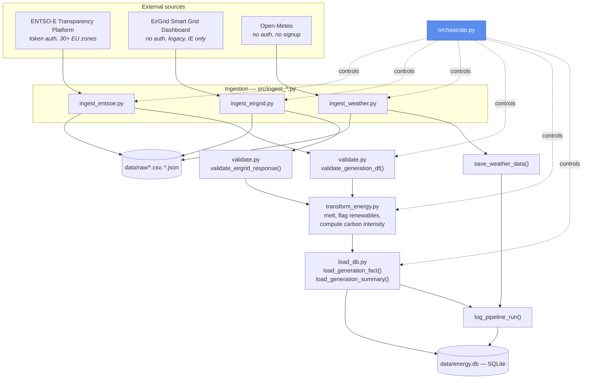
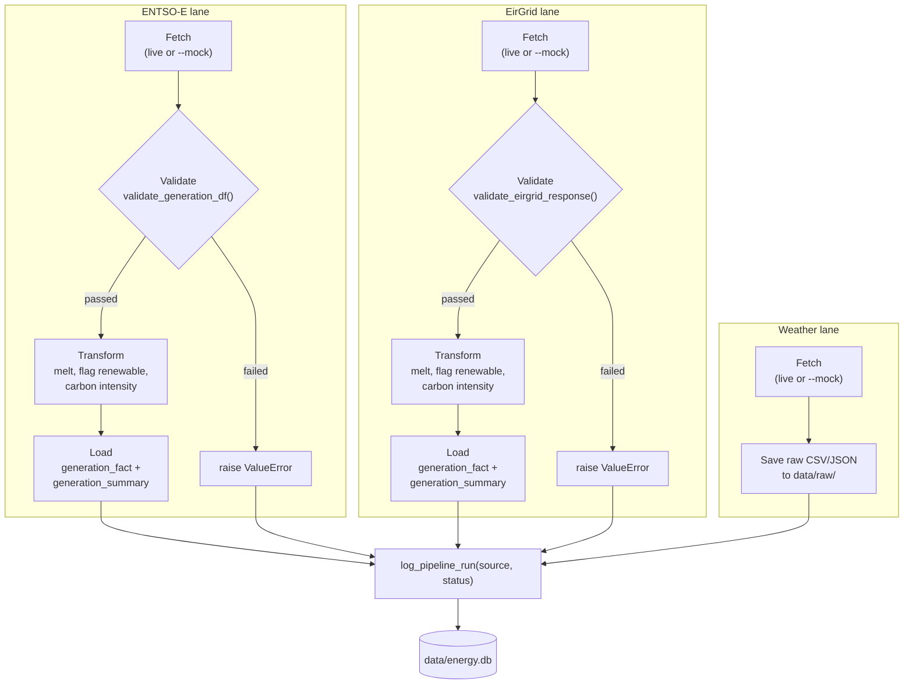
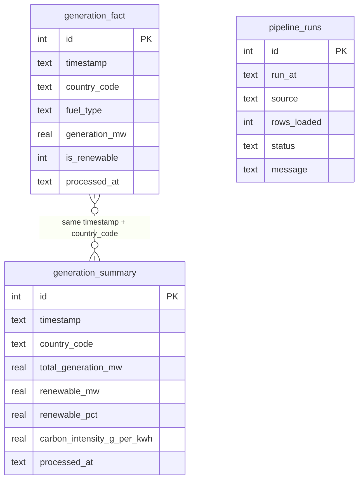
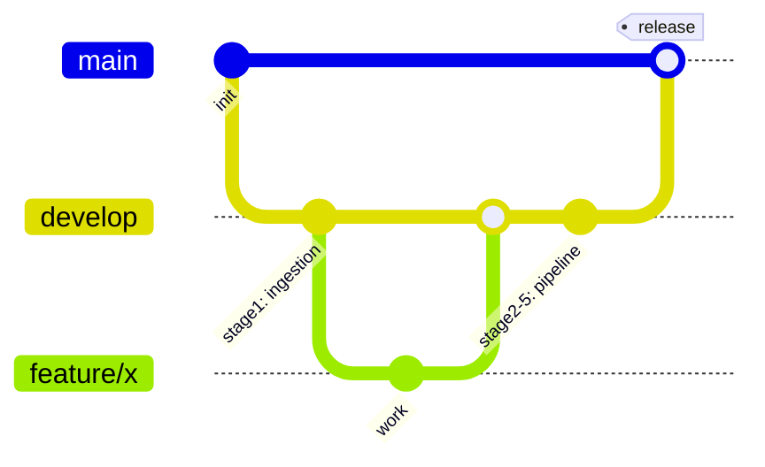

# Architecture & Data Flow

Reference diagrams for `energy-data-pipeline`. These render natively on GitHub (no plugins needed) since they're standard Mermaid fenced code blocks.

## System architecture

Three independently-authenticated sources feed the same shared validate → transform → load machinery, coordinated by `orchestrate.py`. Weather takes a lighter path since it isn't generation data — it doesn't have a `fuel_type`/`is_renewable` shape to validate or transform, so it goes straight to storage plus the shared run-log.

## Data flow (swimlanes by source)

Each source is its own lane through `orchestrate.py`. ENTSO-E and EirGrid both earn their way into `generation_fact`/`generation_summary` through the same validate → transform → load sequence and can fail at the validate step; weather has no generation shape to validate or transform against, so its lane is shorter by design, not by omission. All three converge on the same `log_pipeline_run()` call, so every run - success or failure, any source - lands in one queryable place.

## Database schema

SQLite, created and upserted by `load_db.py`. Fact and summary rows aren't linked by a foreign key — they're correlated by `(timestamp, country_code)`, which is also the natural join key for a future weather-vs-generation analysis (Stage 6).

## Branching model (GitFlow)

- `feature/*` branches off `develop`, PRs back into `develop`
- `develop` → `main` only via a reviewed PR (never a direct push)
- CI (`ruff check` + `pytest`) gates every push and PR on every branch; artifact packaging only runs on `main`/`release/*`/`hotfix/*`
