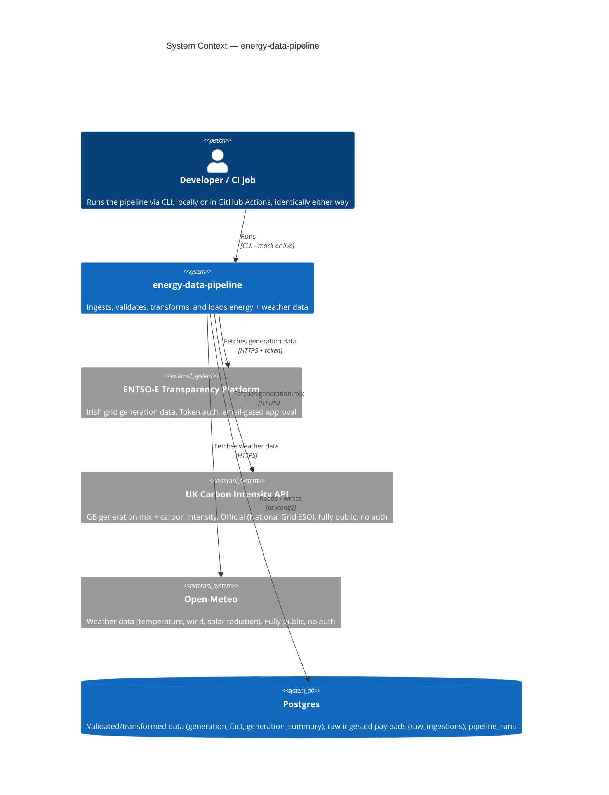
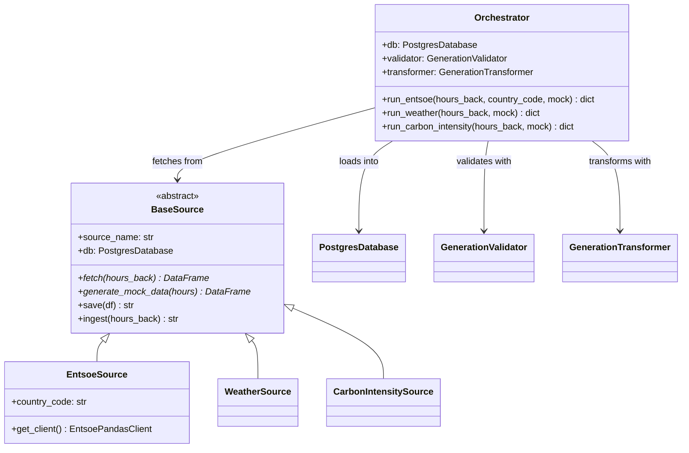
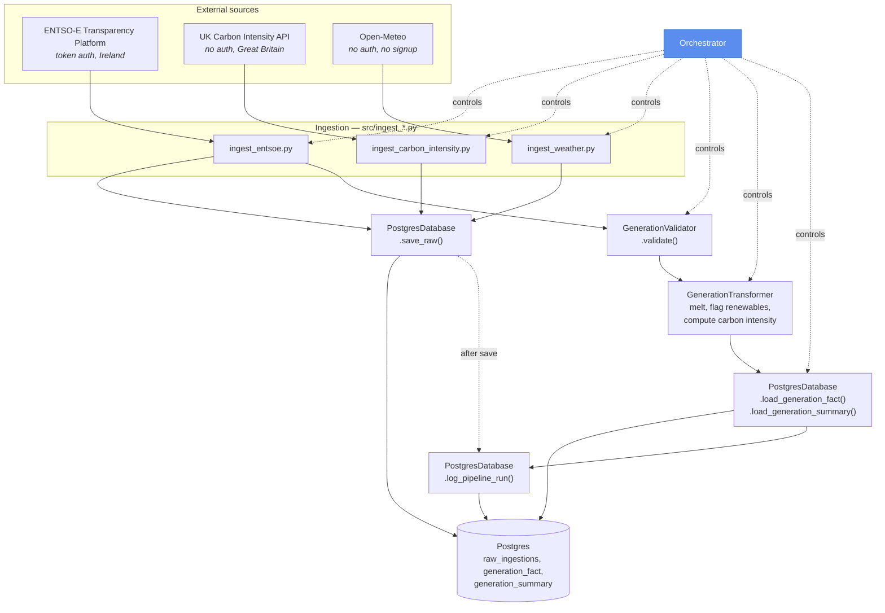
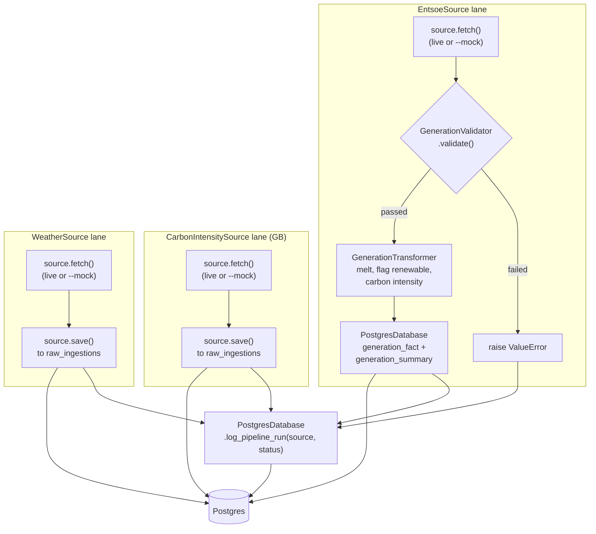
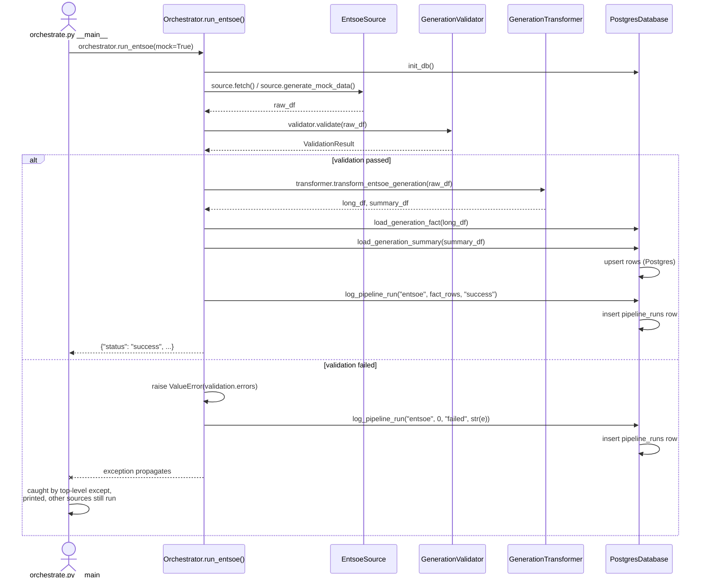
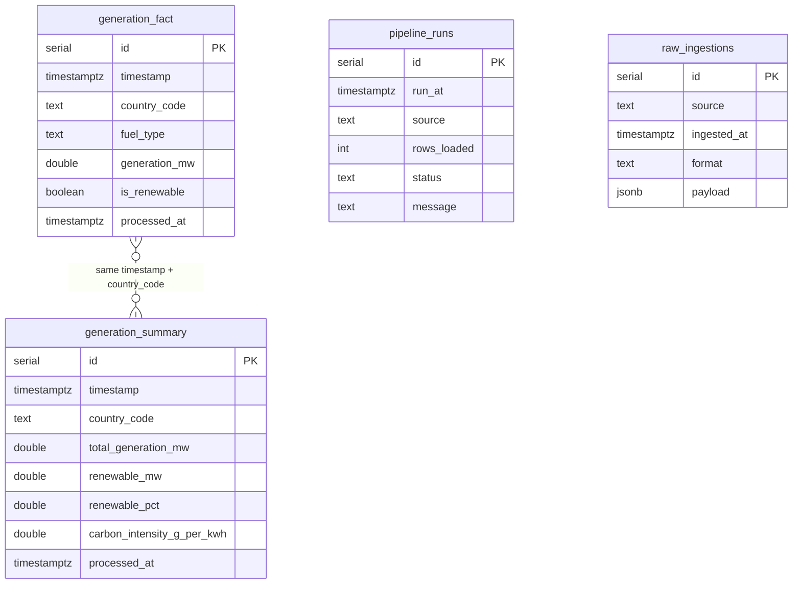
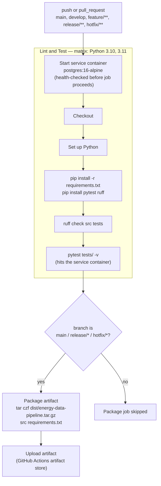
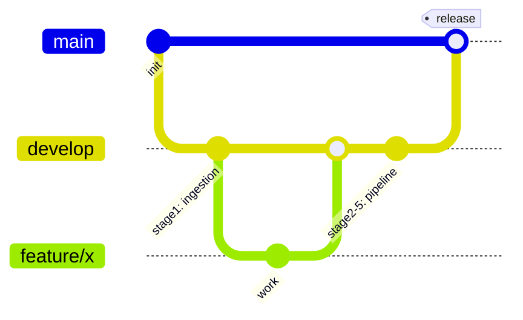

# Architecture & Data Flow

Reference diagrams for `energy-data-pipeline`. These render natively on GitHub (no plugins needed) since they're standard Mermaid fenced code blocks.

## System context (C4 level 1)

The zoomed-out view before the detail: what's inside the system boundary versus what's external to it. One actor (a developer or a CI job, running the same CLI either way), three external data sources, one local sink - a single relational store for both trusted, validated data and raw payloads (via a JSONB column for the latter).



## Class hierarchy

Every source subclasses `BaseSource`, which is what lets `Orchestrator` treat `EntsoeSource`, `WeatherSource`, and `CarbonIntensitySource` interchangeably for the parts of the pipeline that don't care which one it is - `save()`/`ingest()` and the single `IngestionError` type. `Orchestrator`'s other dependencies (`PostgresDatabase`, `GenerationValidator`, `GenerationTransformer`) are constructor-injected rather than module-level globals, which is what lets tests substitute fakes/mocks instead of monkeypatching module functions.



## System architecture

Three independently-authenticated sources, coordinated by `orchestrate.py`. Every source's raw payload goes to Postgres's `raw_ingestions` table via `PostgresDatabase.save_raw()` first - that's the "bronze" layer, schema-flexible on purpose via a JSONB column. Only ENTSO-E has the `fuel_type`/`is_renewable` shape that `validate.py`/`transform_energy.py` are built around, so it's the only source that additionally earns the validate → transform → load path into `generation_fact`/`generation_summary` - the "silver" layer. Bronze and silver are just tables in the same database now, not separate engines.



## Data flow (swimlanes by source)

Each source is its own lane through `Orchestrator`. ENTSO-E earns its way into Postgres's `generation_fact`/`generation_summary` through validate → transform → load, and can fail at the validate step; the GB carbon-intensity source and weather have no `fuel_type`/MW generation shape to validate or transform against, so their lanes are shorter by design, not by omission - straight to `raw_ingestions`. All three converge on the same `PostgresDatabase.log_pipeline_run()` call, so every run - success or failure, any source - lands in one queryable table.



## Run sequence (success and failure paths)

The swimlane diagram shows *what path data takes*; this shows *who calls whom, in what order* - including what happens when validation fails. `Orchestrator.run_entsoe()` is the only source with a validate/transform branch to show; `run_carbon_intensity()` and `run_weather()` share one private helper, `_run_raw_only_pipeline()`, for their shorter fetch → save → log sequence (see the swimlane diagram above).



## Database schema

### Postgres

All four tables are created and owned by `PostgresDatabase`. `generation_fact`/`generation_summary` are upserted via `INSERT ... ON CONFLICT DO UPDATE`; fact and summary rows aren't linked by a foreign key — they're correlated by `(timestamp, country_code)`, which is also the natural join key for a future weather-vs-generation analysis (Stage 6). `raw_ingestions` is the bronze layer — no fixed schema on `payload`, since it's whatever shape the source's DataFrame produced (a `JSONB` column, not a set of typed columns), which is exactly the point: a new source, or a source's API changing shape, needs no migration here. It has no `UNIQUE` constraint (unlike the other three) since every ingest run appends a new row rather than upserting.



Example `raw_ingestions` row (`payload` shown expanded; it's stored as a single JSONB value):

```json
{
  "id": 42,
  "source": "weather",
  "ingested_at": "2026-08-06T11:55:36.999+00:00",
  "format": "records",
  "payload": [
    { "index": "2026-08-06T10:00:00+01:00", "temperature_2m": 15.6, "wind_speed_10m": 8.6, "location": "Dublin" },
    { "index": "2026-08-06T11:00:00+01:00", "temperature_2m": 16.1, "wind_speed_10m": 9.2, "location": "Dublin" }
  ]
}
```

## CI/CD pipeline

From `.github/workflows/ci.yml`. Every push and PR gets linted and tested across both Python versions; only branches actually headed to production get packaged. Postgres runs as a GitHub Actions **service container** - ephemeral, one per job run, on the runner's default port (no local-port-collision workaround needed there, unlike `docker-compose.yml`).



A second, independent workflow, `.github/workflows/scheduled-run.yml`, is what actually runs the pipeline in production - `ci.yml` above only lints, tests, and packages. It fires on a cron schedule (or a manual `workflow_dispatch`) and runs `python src/orchestrate.py` live against a managed Postgres, authenticated via repo secrets rather than the service-container credentials `ci.yml` uses. See the README's "Production Deployment" section for setup.

## Branching model (GitFlow)



- `feature/*` branches off `develop`, PRs back into `develop`
- `develop` → `main` only via a reviewed PR (never a direct push)
- CI (`ruff check` + `pytest`) gates every push and PR on every branch; artifact packaging only runs on `main`/`release/*`/`hotfix/*`
